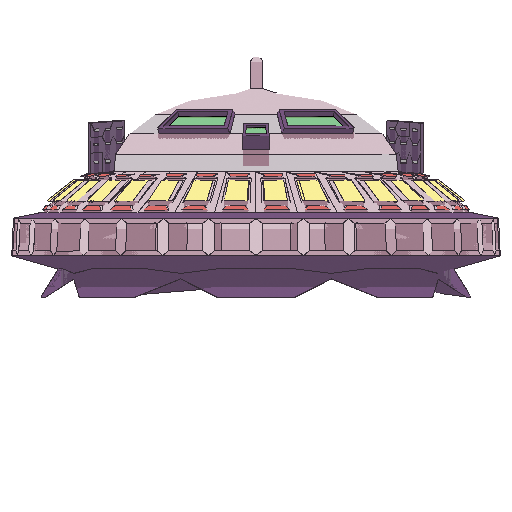

 

  

<h3 align="center">Tutorial Game Development 2024/2025</h3>

  

    Samuel Taniel Mulyadi - 2206081805
     
    <a href="https://github.com/SamuelTanielM/tutorial-2-gamedev><strong>Explore the code »</strong></a>
     
     
    <a href="https://samueltaniel.itch.io">View Site</a>
    ·
    <a href="https://csui-game-development.github.io">View Assignment</a>
  

 

🏪 (┬┬﹏┬┬)q(≧▽≦q)✪ ω ✪(≧∀≦)ゞ( •̀ ω •́ )✧◉_◉ヾ(≧▽≦*)o(´。＿。｀)(◔◡◔)ヾ(⌐■_■)ノ♪(o゜▽゜)o✨

# 🚀 Game Development Tutorial 2024/2025

📌 Table of Contents

  
- [🚀 Game Development Tutorial 2024/2025](#-game-development-tutorial-20242025)
  - [📌 Table of Contents](#-table-of-contents)
  - [✨ Tutorial 2 - Introduction to Game Engine ](#tutorial-2)
  - [✨ Tutorial 3 - Coming Soon ](#tutorial-3)
    

---

✨ Tutorial 2

## ✨ Tutorial 2 - Introduction to Game Engine 

📌 Table of Contents

  
  - [1. Apa saja pesan log yang dicetak pada panel Output?](#question-1)
  - [2. Gerakkan landasan ke batas area bawah dan kembali ke atas.](#question-2)
  - [3. Buka scene MainLevel dengan tampilan workspace 2D.](#question-3)
  - [4. Scene BlueShip dan StonePlatform memiliki child node bertipe Sprite.](#question-4)
  - [5. Perbedaan RigidBody2D dan StaticBody2D.](#question-5)
  - [6. Ubah nilai atribut Mass pada RigidBody2D di BlueShip.](#question-6)
  - [7. Ubah nilai atribut Disabled pada CollisionShape2D di StonePlatform.](#question-7)
  - [8. Manipulasi Position, Rotation, dan Scale BlueShip.](#question-8)
  - [9. Mengapa nilai Position node tidak sesuai di Inspector?](#question-9)
  - [10. Latihan Mandiri: Membuat Level Baru](#question-9)
    

---

### **1. Apa saja pesan log yang dicetak pada panel Output?** 
`Platform initialized`
 `Reached objective!`  
Pesan log akan muncul saat menyentuh batas atas area permainan. Jika dilakukan berkali-kali, output `"Reached objective!"` akan terus bertambah.

 

### **2. Gerakkan landasan ke batas area bawah dan kembali ke atas.** 

`Platform initialized`
 `Reached objective!`
 `Reached objective!`

Jika menyentuh batas atas setelah bergerak dari batas bawah, `"Reached objective!"` akan muncul setiap kali menyentuhnya.

 

### **3. Buka scene `MainLevel` dengan tampilan workspace 2D.** 

Ya, scene `ObjectiveArea` berada di batas atas area. Oleh karena itu, saat kita menyentuhnya, pesan log yang muncul adalah:
 `Reached objective!`

 

### **4. Scene BlueShip dan StonePlatform memiliki child node bertipe Sprite.** 

`Sprite` digunakan untuk menampilkan gambar (texture) dalam game. Sprite sendiri tidak memiliki properti fisika, tetapi dapat berinteraksi dengan dunia game jika dikombinasikan dengan `CollisionShape2D`.

 

### **5. Perbedaan `RigidBody2D` dan `StaticBody2D`.** 

- **`RigidBody2D`**: Memiliki simulasi fisika aktif (dipengaruhi gravitasi, gaya, dan tabrakan).  
- **`StaticBody2D`**: Tidak bergerak, tetapi bisa berinteraksi dengan objek lain. Biasanya digunakan untuk lantai dan dinding.

 

### **6. Ubah nilai atribut `Mass` pada `RigidBody2D` di BlueShip.** 

- **Jika `mass` meningkat** → BlueShip lebih sulit dipercepat dan lebih lambat bergerak.  
- **Jika `mass` berkurang** → BlueShip lebih mudah terdorong oleh gaya atau tabrakan.

Efeknya tidak selalu terlihat jelas dan perlu diamati dengan teliti.

 

### **7. Ubah nilai atribut `Disabled` pada `CollisionShape2D` di StonePlatform.** 

Jika atribut `Disabled = true`, maka **StonePlatform tidak akan memiliki bentuk tabrakan**, sehingga BlueShip bisa menembusnya seperti tidak ada objek di sana.

 

### **8. Manipulasi `Position`, `Rotation`, dan `Scale` BlueShip.** 
- **`Position`** → Mengubah koordinat BlueShip dalam dunia game.  
- **`Rotation`** → Memutar BlueShip.  
- **`Scale`** → Tidak dapat diubah langsung di `RigidBody2D`, harus melalui `Sprite` dalam scene `BlueShip`.

📌 Jika mencoba mengubah ukuran `RigidBody2D`, akan muncul error:
 `Size changes to RigidBody2D will be overridden by the physics engine when running. Change the size in children collision shapes.`

 

### **9. Mengapa nilai `Position` node tidak sesuai di Inspector?** 

Karena **StonePlatform** dan **StonePlatform2** berada dalam **Node Parent `PlatformBlue`**, maka transformasi (Position, Rotation, Scale) yang terlihat di Inspector **berdasarkan parent**.

📌 **Godot mewarisi transformasi parent ke child nodes**, jadi jika parent memiliki offset, semua child akan mengikuti relatif terhadapnya.

 

### **10. Latihan Mandiri: Membuat Level Baru** 

Pada latihan mandiri, saya menambahkan beberapa fitur baru:  

- 🚀 Sprite objek pesawat baru berupa **UFO**.  
- 🌑 Objek landasan baru berupa **Moon Platform**.  
- 🎯 Perubahan penempatan **objective**.  
- ☄️ **Rintangan meteor**.  
- 🔄 **Reset level** saat pesawat terkena meteor atau jatuh keluar area.  
- 🛑 **Collision box** di luar area atas dan samping permainan.  
- 🖼️ **Background baru** agar lebih imersif.  
- 🏆 **UI tambahan** untuk memperjelas objektif, menang, dan tombol **Play Again**.  
- ✨ UFO dilengkapi **partikel efek** saat bergerak untuk lebih banyak polesan.

🚀 **Sekian terima kasih (┬┬﹏┬┬)**

[Back to Top](#readme-top)

---

✨ Tutorial 3

## ✨ Tutorial 3 - Coming Soon 

📌 Table of Contents

  
  - [1. Apa saja pesan log yang dicetak pada panel Output?](#question-11)
    

### **10. Latihan Mandiri: Membuat Level Baru** 

Pada latihan mandiri, saya menambahkan beberapa fitur baru:  

- 🚀 Sprite objek pesawat baru berupa **UFO**.  
- 🌑 Objek landasan baru berupa **Moon Platform**.  
- 🎯 Perubahan penempatan **objective**.  
- ☄️ **Rintangan meteor**.  
- 🔄 **Reset level** saat pesawat terkena meteor atau jatuh keluar area.  
- 🛑 **Collision box** di luar area atas dan samping permainan.  
- 🖼️ **Background baru** agar lebih imersif.  
- 🏆 **UI tambahan** untuk memperjelas objektif, menang, dan tombol **Play Again**.  
- ✨ UFO dilengkapi **partikel efek** saat bergerak untuk lebih banyak polesan.

🚀 **Sekian terima kasih (┬┬﹏┬┬)**

[Back to Top](#readme-top)

---

